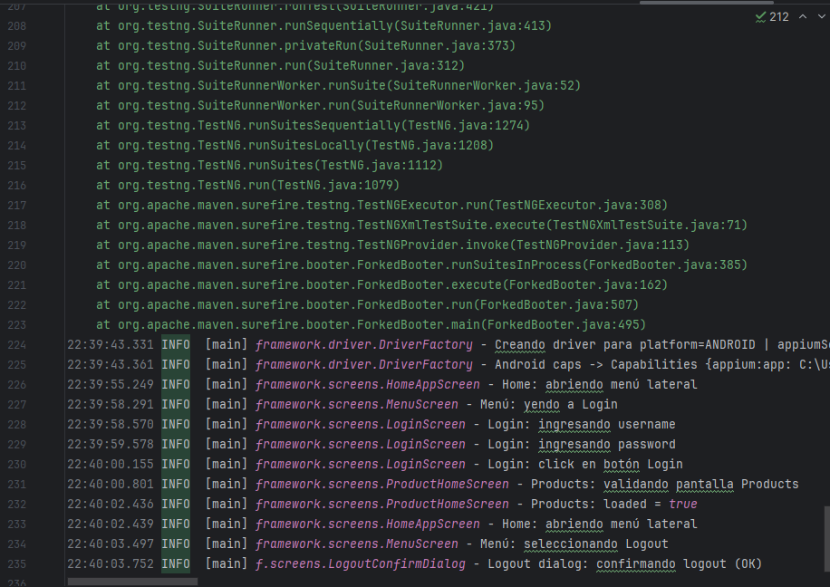
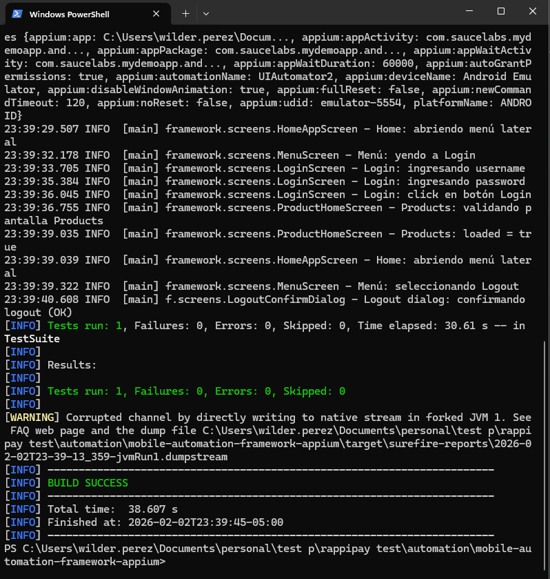

# Mobile Automation Framework (Appium + Java + TestNG)

Framework de automatización mobile para Android que ejecuta un flujo funcional:

1. Abrir la aplicación
2. Login con credenciales válidas
3. Validar que el home de productos cargó correctamente
4. Logout

La solución está basada en Appium, Java y TestNG siguiendo una estructura de framework reutilizable y escalable.

---
## Repositorio

Código fuente disponible en:  
<Por agregar link de mi gthub>

---
## Requisitos

- Java 11 o superior (proyecto compilado con Java 17)
- Maven 3.8+
- Appium Server 2.x
- Android SDK
- Emulador Android o dispositivo físico

---
## Dependencias principales

- Appium Java Client 9.3.0
- Selenium 4.32.0
- TestNG 7.10.2
- SLF4J 2.0.13
- Logback 1.5.6

Las versiones están fijadas en el pom.xml para asegurar estabilidad del proyecto.

---
## Estructura del proyecto

mobile-automation-framework/
├─ README.md
├─ pom.xml
├─ logs/
├─ src/
│  ├─ main/java/framework/
│  │     ├─ config/
│  │     ├─ driver/
│  │     ├─ screens/
│  │     ├─ utils/
│  │     ├─ reporting/
│  │     └─ logging/
│  └─ test/
│     ├─ java/tests/
│     └─ resources/
│        ├─ Suites/
│        ├─ android.properties
│        └─ logback.xml

---
## Configuración

El archivo principal de configuración se encuentra en:

src/test/resources/android.properties

Aquí se definen:
- Dispositivo
- Ruta del APK
- Servidor Appium
- Parámetros de la aplicación

---
## Ejecución de pruebas

1. Levantar Appium:

```bash
appium
```

2. Ejecutar la suite:

mvn clean test -DsuiteXmlFile=src/test/resources/suites/testng-smoke.xml

---
## Decisiones de diseño

- Screen Object Pattern para separar la lógica de UI de los tests.
- DriverFactory y DriverManager para centralizar la creación y manejo del driver.
- ConfigManager para evitar valores hardcodeados.
- Logging desacoplado usando SLF4J + Logback.
- Estructura preparada para escalar a múltiples pantallas y flujos.

---
## Logs de ejecución

Los logs se generan en consola y en:

logs/execution.log

---
## Evidencias de ejecución

A continuación se muestran evidencias del flujo automatizado ejecutado correctamente.

### Captura del flujo



### Logs de ejecución

Los logs generados durante la ejecución se encuentran en:

logs/execution.log

Estos logs muestran la creación del driver, interacción con pantallas, validación del home y logout.
